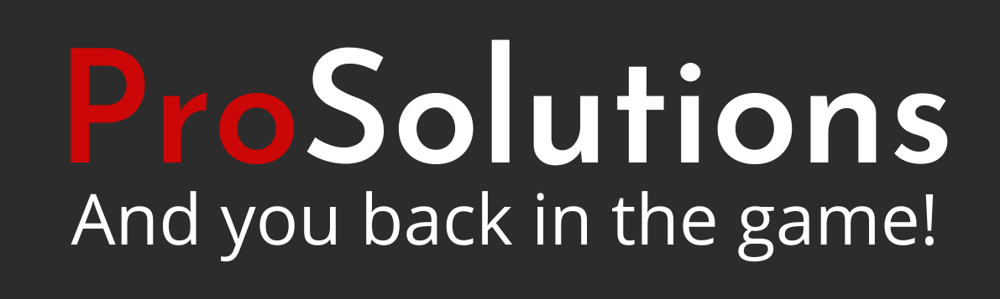

# Milestone Project 1

***

## Pro Solutions

This project is a summary of learning of the three modules of the Full Stack Developer Cours - HTML, CSS, User Centric Frontend Development, the aim of which was to create a mobile, fully responsive website for the "Pro Solutions" video game console service.

Thanks to this website, people interested in repairing their consoles will have the opportunity to familiarize themselves with the services, prices and will be able to contact the service directly for advice via the contact form.

## Table of contents
- <a href="#project">Project Construction 👷</a>
- <a href="#ux">User Experience Design 🧠</a>
- <a href="#tech">Technologies Used 🔨</a>
- <a href="#features">Features List 😲</a>
- <a href="#testing">Testing 🔥</a>
- <a href="#deployment">Deployment 🚀</a>
- <a href="#credits">Credits 🙏</a>

---

## 1️⃣ Project Construction 👷
This project uses the Bootstrap Framework to create a multi-page, fully responsive website with a mobile-first approach. The project is fully compliant with the requirements set by Code Institute, it does not contain java-script or back-end functions.

Despite the above, the website contains two forms, although there is no confirmation of submitting the application and the information is sent to the Code Institute server for demonstration purposes.

As my skill level grows, the functionality of the website will evolve to include java script features, back-end features and online payments. Then it can be used for commercial purposes.

<a href="#top">Back to top ⬆️</a>

## 2️⃣ User Experience Design 🧠

### To whom the website is addressed❓

The main target of the website are people who are looking for a game console repair service for repair or consultation.

### What the visitors expect❓

The main reasons for visiting service website are:

- 👓 To see what the service offer.

- 💰 To check prices for a repair.

- 📞 To contact the service.

- 📓 To book a service.

### Why does my website meet these requirements❓

- 👓 The main page presents and illustrates what repairs are carried out by the service. Encourage to cooperate and presents customer reviews.

- 💰 It is very easy to find the page with prices and a brief description of the repair using the navbar Price tab or the large button visible on the main page.

- 📞 There is a lot of informations on how to contact the service. From number, email, social links at the top of the page, addres in the footer and the Contact page with map and contact form.

- 📓 The service can be booked via the Repair Order button located in the footer on each page.

### Wireframes:

<a href="#top">Back to top ⬆️</a>

## 3️⃣ Technologies Used 🔨

- HTML - Standard markup language for documents designed to be displayed in a web browser.

- CSS - Describes how HTML elements are to be displayed on screen, paper, or in other media.

- <a href="https://getbootstrap.com/" style="_blank">Bootstrap</a> - Potent front-end framework used to create modern websites and web apps.

- <a href="https://www.gitpod.io/" style="_blank">Gitpod</a> - An online IDE which can be launched from any GitHub page

- <a href="https://github.com/" style="_blank">GitHub</a> -A Git repository hosting service

- Google Chrome Dev Tools - A set of web developer tools built directly into the Google Chrome browser.

- <a href="https://www.bootstrapcdn.com/" style="_blank">Javascript / JQuery</a>  - For the Modal and Responsive Navbar expand and collapse functionality.

- <a href="https://fancyapps.com/fancybox/3/" style="_blank">Fancybox3</a> - JavaScript lightbox library for presenting various types of media.
Responsive, touch-enabled and customizable.

- <a href="https://fontawesome.com/" style="_blank">Font Awesome</a> - A web font containing all the icons from the Twitter Bootstrap framework, and now many more.

- <a href="https://fonts.google.com/" style="_blank">Google Fonts</a> - A library of 999 free licensed font families.

- <a href="https://www.google.com/maps/@53.3900981,-6.2363592,14z" style="_blank">Google Maps</a>  - For embedding google map location.

<a href="#top">Back to top ⬆️</a>

## 4️⃣ Features List 😲

### Header

- Clickable email that opens in user email program

- Clickable Font Awesome icons that will link to social media

### Navbar

- Clickable logo that will link to Home page

- Navbar links with hover background

### Footer

- Links to each device on Prices page

- Repair Order button that will link to Repair Order form

### Home page

- Quotes carousel

### Gallery page 

- Display images in Fancybox3 gallery

### Contact page

- Embed Google Maps

- Contact form

<a href="#top">Back to top ⬆️</a>

## 5️⃣ Testing 🔥

I have personally tested the website on several devices and browsers, and I have not noticed any visible errors. All links are working. Both forms tested successfully, missing text in the required field gave an error.

### Devices Used:

- Samsung Galaxy S7 - Android 8.0.0 👍

- Lenovo tab E10 - Android 8.0.0 👍

### Browsers Used:

- Chrome 👍

- Firefox 👍

- Microsoft Edge 👍

### Issues and Bugs:

I did not notice any problems with the operation of the website on any of my devices or browsers. However, taking into account my experience, I cannot say that the website is error-free.

<a href="#top">Back to top ⬆️</a>

## 6️⃣ Deployment 🚀

Project was started from Code Institute <a href="https://github.com/Code-Institute-Org/gitpod-full-template">gitpod-full-template</a> and developed using Gitpod’s IDE.  All developments were pushed to the corresponding repository in GitHub account.

In order to deploy the website to Github pages, I:

- Selected the Repository from the Github Dashboard.

- Navigated to "Settings" then "Github Pages".

- Selected "master branch" in Source section.

- Page auto refreshed and link generated under Github Pages section:

    👉 Your site is published at https://zokam1411.github.io/milestone-project-1/

<a href="#top">Back to top ⬆️</a>

## 7️⃣ Credits 🙏

### Media content:
- Hero images: unsplash.com (licence free images)
- Gallery images: ifitit.com (iFixit content is licensed under the Creative Commons BY-NC-SA 3.0 license.)
- Consoles png: cleanpng.com (licence free images)

### Acknowledgments:
- <a href="https://codeinstitute.net">Code Institute</a>
